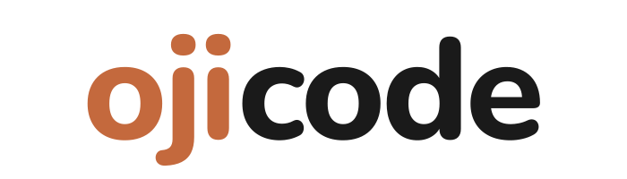

<picture>
  <source media="(prefers-color-scheme: dark)" srcset="assets/ojicode-dark-700.png">
  
</picture>

### Développeur freelance, web et mobile

Applications métier sur mesure pour PME, TPE et indépendants. 
Du premier échange à la maintenance, un seul interlocuteur.

---

Je suis développeur freelance. Je conçois des applications métier sur mesure et je reprends des outils existants, pour des PME, TPE et indépendants. 17 ans dans l'informatique.

### Ce que je fais

- **Applications métier sur mesure** : remplacer un Excel à bout de souffle, suivre une équipe sur le terrain, automatiser ce qui prend trop de temps.
- **Sites web** : vitrines et applications web rapides et soignées.
- **Applications mobiles** : iOS et Android.
- **Reprise & modernisation** : récupérer un projet laissé en plan, résorber la dette technique, faire évoluer une stack vieillissante.

### Comment je travaille

- **Forfait fixe.** Un devis détaillé, un périmètre clair. Vous savez ce que vous payez avant de démarrer.
- **Couverture complète.** Je développe, je déploie et je maintiens. Là où beaucoup s'arrêtent au `git push`, je vais jusqu'à la production et au-delà.
- **Code qui vous appartient.** Outils standards, documentés. Aucune dépendance qui vous enferme : un autre développeur peut reprendre la main quand il le souhaite.

### Stack

**TypeScript · React · Next.js · Node.js · PostgreSQL · MySQL · Docker** 
Mobile : **Capacitor** · Backend léger : **Supabase**, **PocketBase**

J'auto-héberge mes produits maison (Docker, Debian, Cloudflare) ; pour vos projets, je m'adapte à votre hébergeur.

### Réalisations

Mes projets clients et produits sont présentés sur **[ojicode.fr](https://ojicode.fr)** (la plupart sous accord de confidentialité) : du logiciel de gestion terrain offline-first aux portails clients multi-tenants, en passant par des sites avec paiement et espace abonné.

---

Un projet en tête ? Le premier échange est sans engagement.

