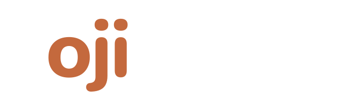

<picture>
  <source media="(prefers-color-scheme: dark)" srcset="assets/ojicode-light-700.png">
  
</picture>

### Développeur freelance, web et mobile

Applications métier sur mesure pour PME, TPE et indépendants. 
Du premier échange à la maintenance, un seul interlocuteur.

---

17 ans dans l'informatique m'ont appris une chose : un bon outil n'est pas celui qui a le plus de fonctions, c'est celui qui colle au métier de ceux qui s'en servent. Je conçois ces outils, et je sais aussi reprendre et moderniser ceux qui existent déjà.

### Ce que je fais

- **Applications métier sur mesure** : remplacer un Excel à bout de souffle, suivre une équipe sur le terrain, automatiser ce qui prend trop de temps.
- **Sites web** : vitrines et applications web rapides et soignées.
- **Applications mobiles** : iOS et Android.
- **Reprise & modernisation** : récupérer un projet laissé en plan, résorber la dette technique, faire évoluer une stack vieillissante.

### Comment je travaille

- **Forfait fixe.** Un devis détaillé, un périmètre clair. Vous savez ce que vous payez avant de démarrer.
- **Couverture complète.** Je développe, je déploie et je maintiens. Là où beaucoup s'arrêtent au `git push`, je vais jusqu'à la production et au-delà.
- **Code qui vous appartient.** Outils standards, documentés. Aucune dépendance qui vous enferme : un autre développeur peut reprendre la main quand il le souhaite.

### Stack

**Front**

**Back & données**

**Mobile**

**Infra**

Je gère aussi ma propre infrastructure auto-hébergée (Debian, Docker, Cloudflare) pour mes produits maison. Pour vos projets, je m'adapte à votre hébergeur.

### Réalisations

Mes projets clients et produits sont présentés sur **[ojicode.fr](https://ojicode.fr)** (la plupart sous accord de confidentialité) : du logiciel de gestion terrain offline-first aux portails clients multi-tenants, en passant par des sites avec paiement et espace abonné.

---

Un projet en tête ? Le premier échange est sans engagement.

